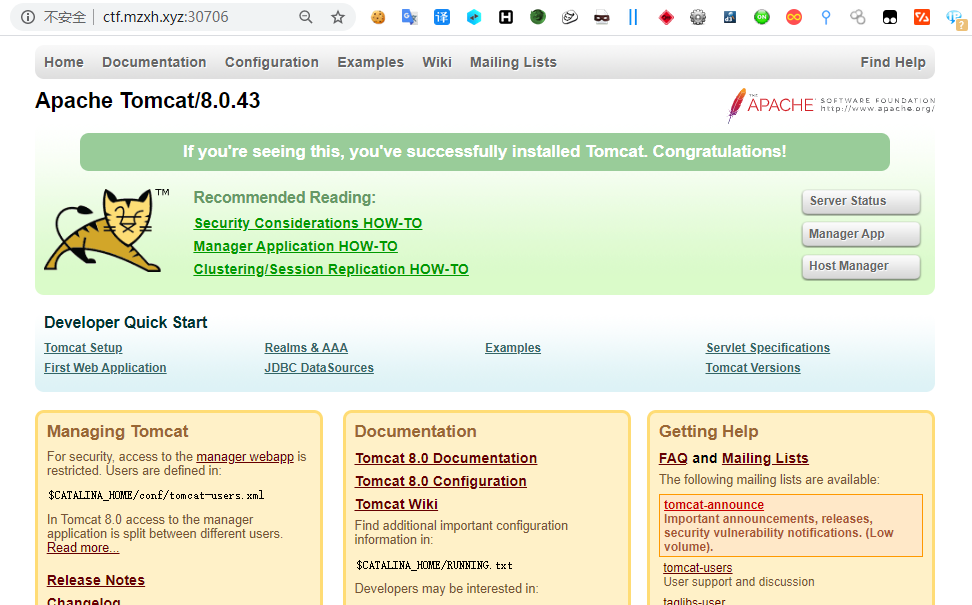
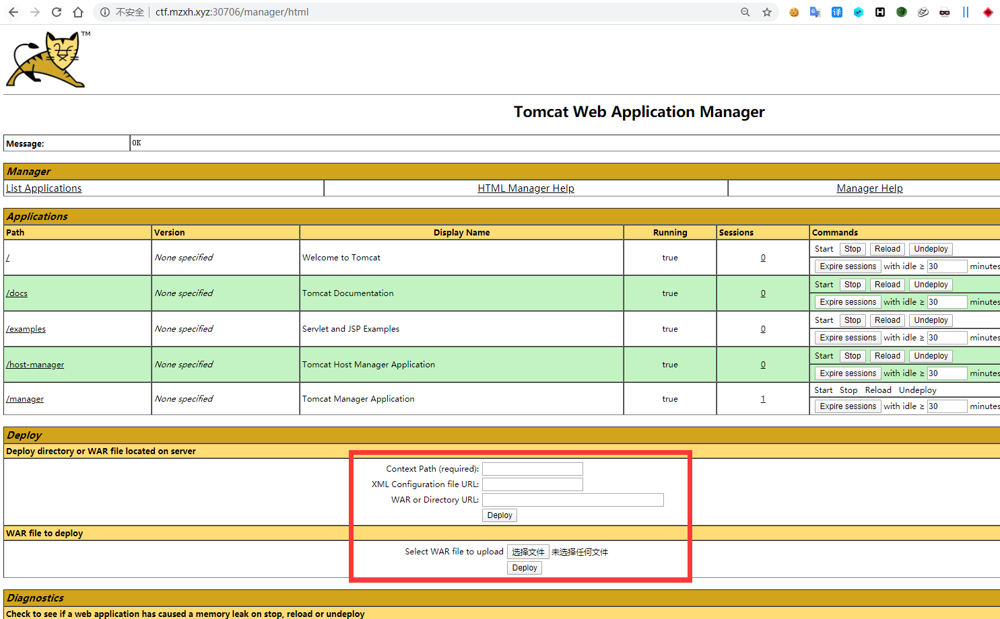
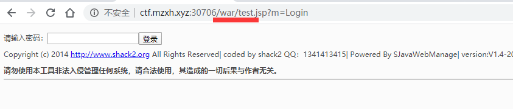
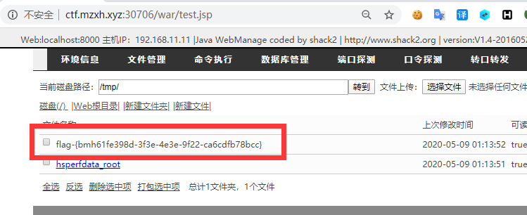

# tomcat pass getshell by [anonymity3712](https://github.com/anonymity3712)

## 漏洞描述

tomcat 作为中间件的一员，漏洞方面也是要了解的。
弱口令进入后台直接上传 war 包 getshell 是一个经典的漏洞。

## writeup

访问靶机地址

直接尝试弱口令登入 Manager App 后台 账号密码 tomcat/tomcat

制作 war 包

先将 jsp 大马压缩为 zip，再将zip后缀改名为 war，然后上传 war 包：

然后构造木马访问路径 http://靶机地址/压缩包名/shell名

获取到flag

