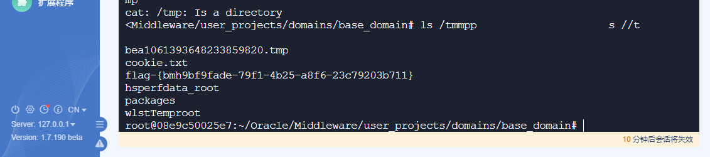

# weblogic（CVE-2020-2551） by [xiajibaxie](https://github.com/xiajibaxie)

## 漏洞描述

2020年1月15日,Oracle 发布了一系列的安全补丁,其中 Oracle WebLogic Server 产品有高危漏洞,漏洞编号 CVE-2020-2551,CVSS 评分9.8分,漏洞利用难度低,可基于 IIOP 协议执行远程代码。影响范围为10.3.6.0.0, 12.1.3.0.0, 12.2.1.3.0, 12.2.1.4.0。

## 利用流程

访问地址： `10.10.11.20:59494`

名称：weblogic（CVE-2020-2551）

使用工具获取 flag 成功

通关！

## 参考

[http://blog.topsec.com.cn/weblogic-cve-2020-2551%E6%BC%8F%E6%B4%9E%E5%88%86%E6%9E%90/](http://blog.topsec.com.cn/weblogic-cve-2020-2551漏洞分析/)

